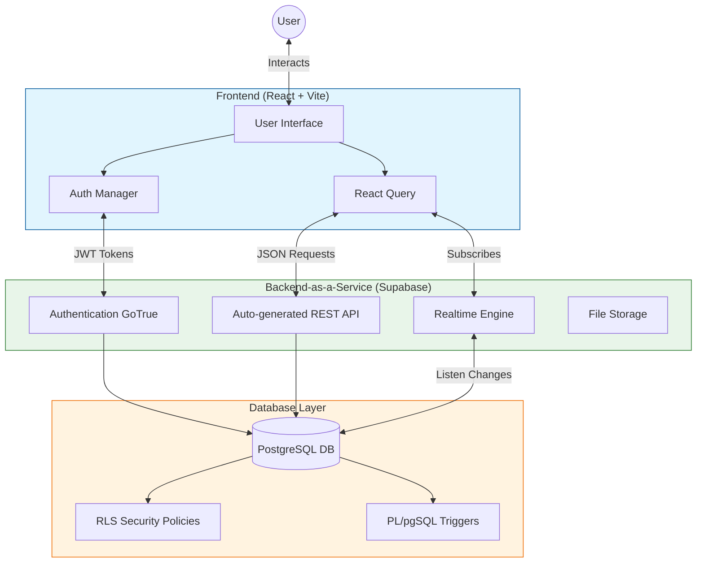

# CAMPUS CONNECT HUB - MINOR PROJECT REPORT

---

## CHAPTER 1: Introduction

### 1.1 Overview of The Project
**Campus Connect Hub** is a specialized web-based platform designed to bridge the gap between students, faculty, and campus resources. Unlike general-purpose social networks, this system is architected specifically for the university ecosystem. It serves as a central hub for three critical campus activities: **Peer-to-Peer Marketplace**, **Lost & Found Recovery**, and **Academic Resource Sharing**. The platform integrates secure authentication, real-time messaging, and an interactive dashboard to provide a seamless user experience for the student community.

### 1.2 Need for The System
In the current campus environment, students face several fragmented challenges:
*   **Inefficient Trading**: Buying and selling gym equipment or books involves scrolling through disorganized WhatsApp groups or physical notice boards.
*   **Lost Items**: Recovering lost valuables depends on luck and word-of-mouth rather than a structured database.
*   **Resource Scatter**: Notes and event details are scattered across various social media channels, making retrieval difficult during exams.
*   **Trust Issues**: Dealing with anonymous users on public platforms carries security risks.
*   **Need for Centralization**: There is an urgent need for a verified, closed-loop system where students can interact with trust and efficiency.

### 1.3 Objectives of the Project
The primary objectives of Campus Connect Hub are:
1.  **To Facilitate Secure Commerce**: Create a "Make Offer" and "Escrow-like" payment simulation to ensure fair pricing and secure transactions between students.
2.  **To Digitize Lost & Found**: Implement a searchable image-based registry for reporting and recovering lost items.
3.  **To Unify Campus Communication**: Enable real-time, context-aware chat for negotiations and queries.
4.  **To Promote Responsiveness**: Ensure the platform works flawlessly across mobile devices, tablets, and desktops using responsive design principles.
5.  **To Verify Identity**: Restrict access to valid users (simulated via strict profile management) to maintain a safe environment.

### 1.4 Scope of the Project
The scope of this project encompasses:
*   **User Module**: Registration, Profile Management, and Wallet Simulation.
*   **Marketplace Module**: functionality to Sell (Upload), Buy (Offer/Accept), and Manage Listings.
*   **Community Module**: Public feeds for Lost & Found items and general discussions.
*   **Communication Module**: A dedicated Inbox for real-time messages.
*   **Admin Module**: Oversight capabilities to monitor listings and transactions.
*   **Future Scope**: The system is designed to be scalable, allowing for future integration of real Payment Gateways (Stripe), AI-moderation, and official University API integration.

### 1.5 Advantages of Responsive Web Design
Since students primarily access the internet via smartphones, the project utilizes **Responsive Web Design (RWD)**:
*   **Cross-Device Compatibility**: The interface automatically adjusts its layout (Grid to Stack) based on screen size (Mobile vs. Laptop).
*   **Improved User Experience**: Touch-friendly buttons and readable typography on small screens ensure accessibility.
*   **Cost Efficiency**: A single codebase (React + Tailwind) serves all devices, eliminating the need for separate native apps.
*   **Faster Maintenance**: Updates are pushed instantly to all users regardless of their device.

### 1.6 Applications of The Website
The Campus Connect Hub finds application in various university scenarios:
*   **Student Marketplace**: For graduating seniors to sell books, cycles, and electronics to juniors.
*   **Lost & Found Registry**: For the security office and students to log and track misplaced items.
*   **Event Management**: For clubs and societies to publicize events and track RSVPs.
*   **Academic Repository**: For sharing semester-specific notes and question papers.
*   **Alumni Network**: Potentially extending to alumni for mentorship or unwanted item donation.

---

## CHAPTER 2: System Analysis

### 2.1 Identification of Needs
A detailed requirement analysis process identified the following core needs:
*   **User Authenticity**: The system must prevent anonymous spam; users must be identifiable.
*   **Real-time Notifications**: Users need instant alerts for offers, chat messages, and status updates.
*   **Visual Listings**: The marketplace requires image support to verify item condition.
*   **Search & Filter**: Efficient retrieval of specific items (e.g., "Engineering Books") or specific lost items.
*   **Admin Oversight**: A mechanism for administrators to approve/reject listings and manage reported content.

### 2.2 Data Model
The system utilizes a relational database model (PostgreSQL via Supabase). Key entities include:
*   **Profiles**: Stores user attributes (Name, Avatar, Wallet Balance). Linked 1:1 with Auth Users.
*   **Marketplace_Items**: Stores item details (Title, Price, Condition, Seller_ID, Status).
*   **Marketplace_Offers**: Tracks negotiation offers between Buyer and Seller.
*   **Notifications**: Event-driven alerts (Offer Received, Accepted, etc.).
*   **Messages**: Chat logs between users.
*   **Lost_Items**: Separate entity for Lost & Found posts.

### 2.3 Dependencies
The project relies on a modern modern tech stack:
*   **Frontend**: React.js (v18), TypeScript (for type safety), Vite (Build tool).
*   **UI Framework**: Tailwind CSS (Styling), Shadcn/UI (Component Library).
*   **Backend / Database**: Supabase (PostgreSQL, Auth, Storage, Realtime).
*   **State Management & Data Fetching**: React Query (TanStack Query).
*   **Icons**: Lucide React.
*   **Notifications**: Sonner (Toast notifications).

---

## CHAPTER 3: System Design

### 3.1 Architecture
The system follows a **Client-Serverless Architecture**:
1.  **Client Layer (Frontend)**: A Single Page Application (SPA) built with React. It handles the UI, user input, and state management. It communicates directly with the Supabase API.
2.  **Service Layer (Supabase)**: Acts as the backend-as-a-service.
    *   **Auth**: Handles JWT based authentication.
    *   **Postgres Database**: Relational data storage.
    *   **API Gateway**: Automatically generated RESTful and Realtime APIs based on database schema.
    *   **Storage**: Object storage for user uploaded images (Listing photos, Avatars).
3.  **Database Layer**: PostgreSQL with Row Level Security (RLS) policies ensuring data access control (e.g., "Only the seller can edit their listing").

### 3.2 System Architecture Diagram

---

## CHAPTER 4: Development

### 4.1 Main Class
In the React ecosystem, the entry point serves as the "Main Class".
*   **`main.tsx`**: The bootstrap file initializes the React application, wraps it in necessary Context Providers (QueryClientProvider for data fetching, RouterProvider for navigation, AuthProvider for user state), and mounts it to the DOM.
*   **`App.tsx`**: Defines the central routing logic, mapping URLs (e.g., `/marketplace`, `/dashboard`) to specific Page components.

### 4.2 Views (Pages & Components)
The User Interface is broken down into modular "Views":
*   **`ListingDetails.tsx`**: A complex view handling item display, image rendering, "Make Offer" dialogs, and "Buy Now" workflows. It includes dynamic logic for countdown timers (Offer Expiry).
*   **`Marketplace.tsx`**: Displays a grid of items with search and category filtering options.
*   **`Dashboard.tsx`**: A user-centric view showing "My Listings", "My Offers", and "Notifications".
*   **`Navbar.tsx`**: Persistent navigation component handling mobile responsiveness and user profile menus.
*   **`LostFound.tsx`**: Specialized view for reporting and searching lost items.

### 4.3 Services
Services handle external communication. In this architecture, custom hooks serve this role:
*   **`useQuery` Hooks**: Encapsulate logic for fetching data (e.g., `useQuery(['listing', id])` automatically fetches and caches listing data).
*   **`supabase.ts` (Client Service)**: A singleton service instance configured with API keys to manage authenticated requests to the backend.

### 4.4 Model (Interfaces)
TypeScript interfaces define the structure of data objects, ensuring consistency:
*   **`MarketplaceItem` Interface**: Defines the shape of an item (id, title, price, status: 'pending'|'approved', image_url).
*   **`Offer` Interface**: Defines the structure of a negotiation (id, amount, buyer_id, accepted_at).
*   **`Profile` Interface**: Defines user data structure.

### 4.5 DB (Database Schema)
The database is implemented in PostgreSQL. Key Implementation details:
*   **Tables**: `marketplace_items`, `profiles`, `notifications`, `marketplace_offers`.
*   **RLS Policies**: Security rules written in SQL (e.g., `CREATE POLICY "Public can view active items"`).
*   **Triggers**: Automated database functions. For example, `notify_seller_on_offer` is a PL/pgSQL function triggered instantly when a new row is added to the offers table.

### 4.6 DAO (Data Access)
While traditional DAOs are abstracted, specific functions handle data manipulation:
*   **`buyMutation`**: A complex transaction function that deducts wallet balance, creates an order record, validates the payment method, and updates item status securely.
*   **`insert({ ... })`**: Supabase client methods used throughout the application to perform CRUD operations (Create, Read, Update, Delete) on the database.

---

## CHAPTER 5: Working

### 5.1 Working of the Code
The application workflow is event-driven and user-interactive:

### 5.1 Marketplace Workflow
The core of the application is the trading system:
1.  **Listing Creation**: Sellers arrive at the "Sell Item" page, selecting categories (Books, Electronics) and conditions. Photos are uploaded to Supabase Storage, and a unique `marketplace_item` record is created.
2.  **Discovery**: Buyers filter items by category or search by keyword. The app queries the database for `status='approved'` items.
3.  **The Offer Cycle**: 
    *   **Negotiation**: Instead of fixed prices, buyers can "Make an Offer".
    *   **Notification**: The seller receives an instant alert via a Postgres Trigger.
    *   **Acceptance**: If the seller accepts, the offer is timestamped (`accepted_at`).
    *   **Purchase**: A "Buy Now" button activates for the buyer with a 1-hour expiration timer.
4.  **Transaction**: The buyer pays using the simulated wallet or uploads a payment proof (UPI Ref ID). The item is marked `sold` and funds are transferred.

### 5.2 Notes (Academic Resources) Workflow
This module democratizes access to study materials:
1.  **Upload**: Students upload PDF notes, selecting their specific Course and Semester.
2.  **Indexing**: The file URL is stored in the `notes` table along with metadata (Subject, Professor, Unit).
3.  **Access**: Uses an embedded PDF viewer. Students can preview notes directly in the browser without downloading, ensuring quick access during exams.
4.  **Filtering**: Users select "Semester 3" -> "Computer Science" to instantly retrieve relevant documents.

### 5.3 Events Module Workflow
Facilitates campus engagement:
1.  **Event Creation**: Organizers post details: Title, Description, Date, Venue, and Banner Image.
2.  **RSVP System**: Students click "Interested" or "Register". The system tracks attendees in a mapping table `event_attendees`.
3.  **Display**: Events are sorted chronologically. Past events are automatically archived visually.
4.  **Dashboard Integration**: Registered events appear in the user’s personal dashboard as reminders.

### 5.4 Community (Lost & Found / Forum)
A utility for solving daily campus problems:
1.  **Reporting**: A user posts "Lost Blue Bottle at Library". They can attach a photo.
2.  **Visibility**: The post appears on the global "Lost & Found" feed.
3.  **Resolution**: 
    *   **Chat**: A finder clicks "Message" to coordinates return securely.
    *   **Status Update**: The owner marks the item as "Found", removing it from the active list to reduce clutter.
    *   **Search**: Users can search "Bottle" to check if theirs has been reported found.

### 5.5 Student Community (Chat & Forum)
1.  **Direct Messaging**: 1-on-1 conversations powered by Supabase Realtime. Used primarily for Marketplace negotiations and Lost & Found coordination.
2.  **Context Aware**: Chats are linked to specific contexts (e.g., "Regarding: Engineering Physics Book"), giving instant context to the recipient.

---

## CHAPTER 6: Conclusion

The **Campus Connect Hub** successfully demonstrates a modern, full-stack approach to solving university interactions. By identifying the specific needs of trust and ease-of-use, the project delivers a functional solution for trading and lost & found.

The implementation of complex features like **Real-time Offers**, **Expiration Logic**, and **Secure Database Triggers** highlights the robustness of the system. Future enhancements could include real payment gateway integration (Stripe/Razorpay), AI-based content moderation, and a mobile native app (React Native) adaptation. The modular design ensures the system is scalable and maintainable for future development.
